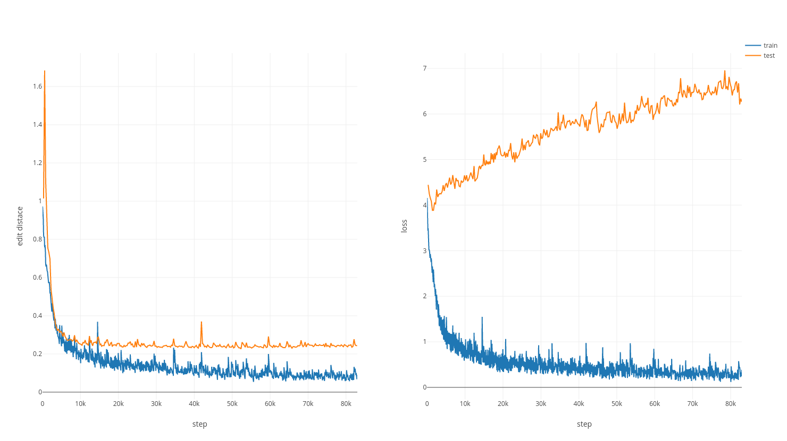

# listen-attend-and-spell

## Overview

**listen-attend-and-spell** contains the implementation of [*Listen, Attend and Spell*][las] (LAS) model based on Tensorflow. In this project, the LAS model is trained via input pipeline and estimator API of Tensorflow, which makes the whole procedure truly end-to-end.

## Usage

### Requirements

Tensorflow and Numpy are needed. Run `pip install -r requirements.txt` to get the lastest version.

### Data Preparing
Before running the training script, you should convert your data into TFRecord format. The code snippet down below may help you understand how to create it:
```python
def make_example(inputs, labels):
    feature_lists = tf.train.FeatureLists(feature_list={
        'labels': tf.train.FeatureList(feature=[
            tf.train.Feature(bytes_list=tf.train.BytesList(value=[p.encode()]))
            for p in labels
        ]),
        'inputs': tf.train.FeatureList(feature=[
            tf.train.Feature(float_list=tf.train.FloatList(value=f))
            for f in inputs
        ])
    })

    return tf.train.SequenceExample(feature_lists=feature_lists)

list_features = [np.random.rand(i * 10, 39) for i in range(10)]
list_labels = np.random.choice(string.ascii_uppercase, size=10)

with tf.python_io.TFRecordWriter('data.tfrecords') as writer:
    for inputs, labels in zip(list_features, list_labels):
        writer.write(make_example(inputs, labels).SerializeToString())
```
Note that it is no need to convert labels into index on your own! Just encode the string-like labels into bytes
More deatils are available at [sequence example][sequence_example].

Moreover, you should create a vocabulary table containing all symbols in your training data. For more details,  please refer to `misc/timit-phone.table`.

### Training and Evaluation
Simply run `python3 train.py --train TRAIN_TFRECORD --vocab VOCAB_TABLE --model_dir MODEL_DIR`. You can also specify the validation data and some hyperparameters. To find out more, please run `python3 train.py -h`.

### Tensorboard
With the help of tensorflow estimator API, you can launch tensorboard by `tensorboard --logdir=MODEL_DIR`  to see the training procedure.

## Result
### TIMIT
The following figures show the results on TIMIT dataset (4620 training sentence and 1680 testing sentence). If you prepare the TFRecord files of TIMIT, you can run the model with `misc/hparams.json` (put it into your model directory) to produce the similar results. Note that, customarily, we map phones into 39 phone set while evaluating TIMIT dataset, and thus, the edit distance evaluated down below is based on 39 phone set.



### VCTK
[VCTK](http://homepages.inf.ed.ac.uk/jyamagis/page3/page58/page58.html) is also used as benchmark. Simply run `./run-vctk.sh` to process data and train the model. Note that since VCTK has no train-test split, the first 90 speakers are chose as the training set, and remaining are the testing set. **For more details about how to extract audio features and create TFRecord files, please refer to `vctk/`**.

## References

- [Listen, Attend and spell][las]
- [How to create TFRecord][sequence_example]
- [nabu's implementation][nabu]
- [Tensorflow official seq2seq code][nmt]

## Contact

Issues and pull requests are welcomed. Feel free to [contact me](mailto:windqaq@gmail.com) if there's any problems.

[nabu]: https://github.com/vrenkens/nabu
[nmt]: https://github.com/tensorflow/nmt
[las]: https://arxiv.org/pdf/1508.01211.pdf
[sequence_example]: https://github.com/tensorflow/magenta/blob/master/magenta/common/sequence_example_lib.py
